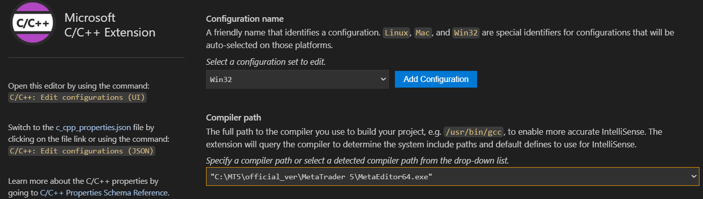
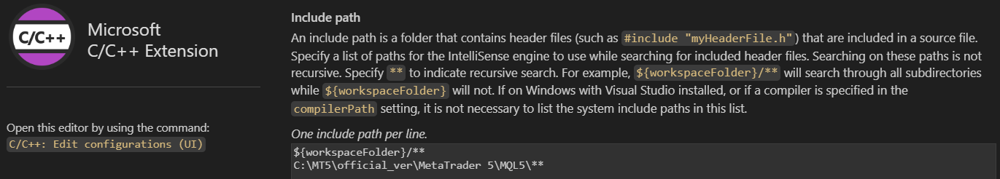

# MT5 × GitHub Development Environment Guide

## Overview
This project documents a clean and reproducible workflow for developing MQL5 code for MetaTrader 5 (MT5) while managing source code on GitHub and editing with VS Code. The goal is to keep MT5's standard folder structure intact while publishing only self-made code to GitHub.

## Folder Structure

### MT5 Environment (Execution)
```MT5 Environment (Execution)
MQL5/
  Experts/
    My_Projects/        <- Junction Link 
      MyEA1/
      MyEA2/
  Indicators/
    My_Projects/        <- Junction Link
      MyIndicator1/
  Include/
    My_Projects/        <- Junction Link
      Common/
```
`MyProjects` folders are Junction links pointing to GitHub-managed directories.

### GitHub Repository (Source Management)
```
MyMQL5_Project/
  Experts/
    MyEA1/
    MyEA2/
  Indicators/
    MyIndicator1/
  Include/
    Common/
  README.md
  .gitignore
  MyMQL5_Project.code-workspace
```


## Junction Link Setup (Windows 11)
Run Command Prompt as Administrator and execute:

### Experts
```Experts
mklink /J "C:\MT5\official_ver\MetaTrader 5\MQL5\Experts\My_Projects" "C:\MyMQL5_Project\Experts"
```

### Indicators
```
mklink /J "C:\MT5\official_ver\MetaTrader 5\MQL5\Indicators\My_Projects" "C:\MyMQL5_Project\Indicators"
```

### Include
```
mklink /J "C:\MT5\official_ver\MetaTrader 5\MQL5\Include\My_Projects" "C:\MyMQL5_Project\Include"
```

To Verify:
```
dir C:\MT5\official_ver\MetaTrader 5\MQL5\Experts\
```
```
dir C:\MT5\official_ver\MetaTrader 5\MQL5\Indicators\
```
```
dir C:\MT5\official_ver\MetaTrader 5\MQL5\Include\
```
`My_Projects` should appear as `<JUNCTION>`.

## .gitignore (Recommended)
```
# Build artifacts
*.ex5
*.ex4

# MetaEditor backups
*.mqh~
*.mq5~
*.bak

# Logs & runtime
Logs/
Tester/
Profiles/

# OS
.DS_Store
Thumbs.db

# VS Code
.vscode/
```

## VS code Setting
### Extention
1. Install C/C++ for Visual Studio Code by Microsft.com.
2. Set "files.association" as below.

3. Set "compiler path" as below.

4. Set "Include path" as below.


## Development Flow
1. Edit code in VS Code (in GitHub Repository (Source Management)).
2. MT5 compiles via Junction links.
3. Test in MT5.
4. Commit and push to GitHub.
5. Use Copilot for review and improvement.