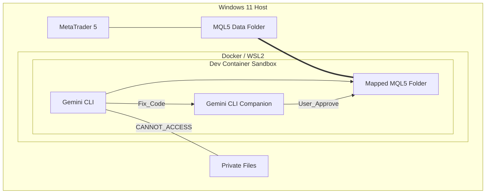

```mermaid
graph TD
    subgraph Windows_Host [Windows 11 Host]
        MT5[MetaTrader 5]
        MQL5_Dir[MQL5 Data Folder]
        Secret_Files[Private Files]
        
        subgraph Docker_Engine [Docker / WSL2]
            subgraph Dev_Container [Dev Container Sandbox]
                G_CLI[Gemini CLI]
                Companion[Gemini CLI Companion]
                Mapped_MQL5[Mapped MQL5 Folder]
            end
        end
    end

    %% 接続関係
    MQL5_Dir === Mapped_MQL5
    MT5 --- MQL5_Dir
    
    %% AIのアクセス権
    G_CLI --> Mapped_MQL5
    G_CLI -- "CANNOT_ACCESS" --- Secret_Files
    
    %% 操作の流れ
    G_CLI -- "Fix_Code" --> Companion
    Companion -- "User_Approve" --> Mapped_MQL5
```
